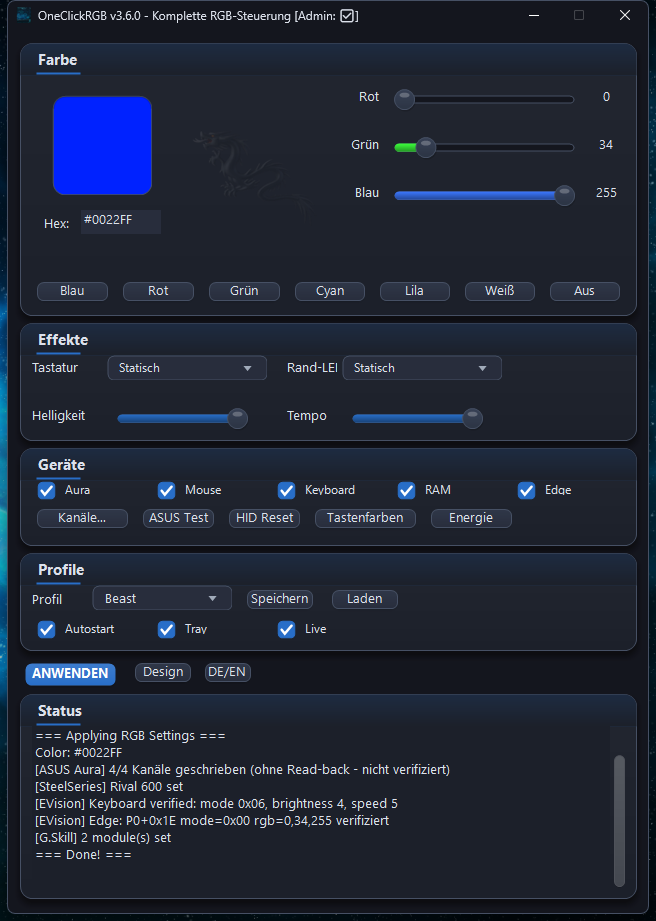
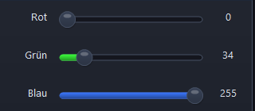
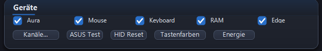
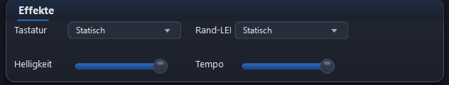
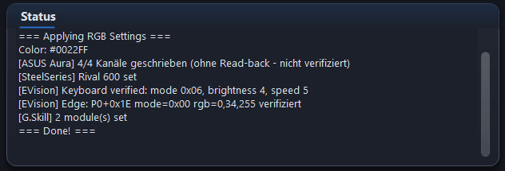

# OneClickRGB

**Lightweight RGB controller for Windows** - Control all your RGB devices with one unified interface.

[](https://github.com/beastwareteam/OneClickRGB/actions)
[](LICENSE)
[]()

---

## Screenshots



| | |
|---|---|
|  |  |
| RGB sliders with live values | One-click colour presets |
|  |  |
| Per-device selection | Keyboard and edge effects |

Every write is read back and reported as verified or rejected - the status log
says what the hardware actually confirmed, not what was sent:



More pictures in the [visual guide](docs/GUIDE.md).

---

## Features

- **Multi-Device Support** - ASUS Aura, SteelSeries, EVision Keyboard, G.Skill RAM
- **One-Click Colors** - Set all devices to one color instantly
- **Profile System** - Save and load color configurations
- **System Tray** - Quick access to presets and power controls
- **Global Hotkeys** - Change colors without switching windows
- **Standby Recovery** - Automatic RGB restore after Windows sleep/resume
- **Themes** - Dark, Light, and Colorblind-friendly modes
- **Tooltips** - Hover over any control for help
- **Accessibility** - Full keyboard navigation (Tab, Enter, Arrow keys)
- **No Dependencies** - Single executable, no runtime installation needed
- **Modern UI** - GDI+ rendered with shadows and rounded corners

---

## Supported Devices

Two columns, deliberately kept apart: **written** means the app sent the
command and the device acknowledged it. **Verified** means the app read the
value back off the device and compared it against what it asked for. A write
that is only acknowledged is not proof - firmware acknowledges writes it
silently discards, which is how several bugs in this project were born.

| Device | Protocol | Write | Read-back verified |
|--------|----------|-------|--------------------|
| **EVision Keyboard** | USB HID - Static, Breathing, Wave, Spectrum, Rainbow, Reactive, Ripple, Starlight | yes | **yes** - mode, brightness and speed are read back |
| **EVision Edge LEDs** | USB HID, profile block `P0+0x1E` | yes | **yes** - mode and RGB are read back |
| **ASUS Aura Mainboard** | USB HID (`0x0B05:0x19AF`) | yes, 4/4 channels | no - written without read-back |
| **ASUS Aura Addressable** | 8 channels, 60 LEDs each | yes | no - written without read-back |
| **SteelSeries Rival 600** | USB HID | yes | no |
| **G.Skill Trident Z5 RGB** | SMBus via PawnIO | yes, per module | no |
| **G.Skill Trident Z5 Neo** | SMBus via PawnIO | yes, per module | no |

The status log reports exactly this per run - see the picture above: the
keyboard line ends in `verified`, the Aura line says
`written (no read-back - not verified)`. Nothing in the app claims success it
did not check.

### Compatibility

- **OS**: Windows 10 (1809+), Windows 11
- **Architecture**: x64 only
- **Privileges**: Administrator **required** - the manifest requests elevation.
  HID access and the SMBus driver do not work without it.
- **G.Skill RAM**: needs the PawnIO driver (`PawnIO_setup.exe`, once) plus
  `SmbusI801.bin`. Intel I801 chipsets are covered by the shipped module;
  other chipsets need the matching module from `dependencies/PawnIO/modules/`.
- **Untested hardware**: devices not in the table above are not addressed at
  all - the app does not probe unknown vendors.

---

## Installation

### Option 1: Portable Package

1. Download `OneClickRGB_v3.6.0_Portable.zip` from [Releases](https://github.com/beastwareteam/OneClickRGB/releases)
2. Extract to any folder
3. Run `install.bat` as Administrator (or just run `OneClickRGB.exe` directly)

### Option 2: Installer

Download `OneClickRGB_Setup_3.6.0.exe` from [Releases](https://github.com/beastwareteam/OneClickRGB/releases) and run it. Installs to Program Files, optional desktop icon and autostart.

### Option 3: Build from Source

```batch
git clone https://github.com/beastwareteam/OneClickRGB.git
cd OneClickRGB
build_native.bat
```

**Requirements**: Visual Studio 2019/2022 Build Tools

See [BUILD.md](BUILD.md) for detailed instructions.

---

## Portable Package Contents

```
OneClickRGB/
├── OneClickRGB.exe     790 KB   Main application
├── hidapi.dll          159 KB   USB HID library
├── PawnIOLib.dll         4 KB   SMBus interface (G.Skill RAM)
├── SmbusI801.bin        40 KB   Intel SMBus module
├── icon.png            193 KB   Application icon
├── PawnIO_setup.exe    3.1 MB   Driver installer (run once)
├── install.bat                  Automatic installation
├── install_manual.bat           Interactive installation
├── uninstall.bat                Clean removal
└── README.txt                   Quick reference
```

---

## Usage

### Global Hotkeys

| Hotkey | Action |
|--------|--------|
| `Ctrl+Alt+B` | Blue |
| `Ctrl+Alt+R` | Red |
| `Ctrl+Alt+G` | Green |
| `Ctrl+Alt+W` | White |
| `Ctrl+Alt+0` | Toggle off / restore |

### Keyboard Navigation

| Key | Action |
|-----|--------|
| `Tab` | Move between controls |
| `Enter` / `Space` | Activate button/checkbox |
| `Arrow Keys` | Adjust sliders |

### System Tray

Right-click the tray icon for quick access to:
- Color presets
- Profiles
- Power controls (Standby, Shutdown, Restart)
- Settings

---

## Themes

Switch between themes using the Theme button:

| Theme | Description |
|-------|-------------|
| **Dark** | Default dark mode with blue accent |
| **Light** | Bright mode with clean appearance |
| **Colorblind** | Warm cream tones, Orange/Blue palette |

---

## Configuration

Settings are stored in `%APPDATA%\OneClickRGB\`:

| File | Description |
|------|-------------|
| `app_settings.cfg` | Window position, language, theme |
| `profiles/*.json` | Saved color profiles |

---

## Version History

### v3.6 (Current)
- Fixed the three colour rows: value labels no longer pile digits on top of each other
- Fixed the sliders: the filled track follows a programmatic position change
- Preset button glow halved
- Version aligned across binary, resource and installer (3.6.0)
- Screenshots refreshed, hotkey tables corrected against the code

### v3.5
- Info tooltips on all controls
- Theme system (Dark/Light/Colorblind)
- Keyboard accessibility
- Live RGB value display
- Portable package with installers
- Repository cleanup

### v3.4
- Production-ready build system
- Fixed RAM control (relative paths)
- One-click build script

### v3.3
- Global hotkeys
- Window position memory
- System tray improvements

### v3.2
- Standby/resume detection
- HID reset on wake
- Power menu in tray

See [ROADMAP.md](ROADMAP.md) for planned features.

---

## Troubleshooting

### "Device not found"
- Run as Administrator
- Check if device is connected
- Some devices need specific USB ports

### "RAM not detected"
- Run `PawnIO_setup.exe` once as Administrator
- Restart PC after driver installation
- Check `PawnIOLib.dll` and `SmbusI801.bin` are present

### "Colors don't persist after sleep"
- Enable "Autostart" in settings
- App must be running (system tray)

---

## Source Structure

```
src/
├── oneclick_rgb_complete.cpp   Main application (all-in-one)
├── themes.h                    Theme definitions
├── channel_config.h            Channel configuration
├── modern_ui.h                 UI components
└── OneClickRGB.ico/rc/res      Resources
```

---

## Contributing

Contributions welcome! See [CODE_OF_CONDUCT.md](CODE_OF_CONDUCT.md).

---

## License

MIT License - see [LICENSE](LICENSE)

---

## Credits

- **HIDAPI** - Cross-platform HID library
- **PawnIO** - SMBus access for RAM control
- **OpenRGB** - Protocol documentation
