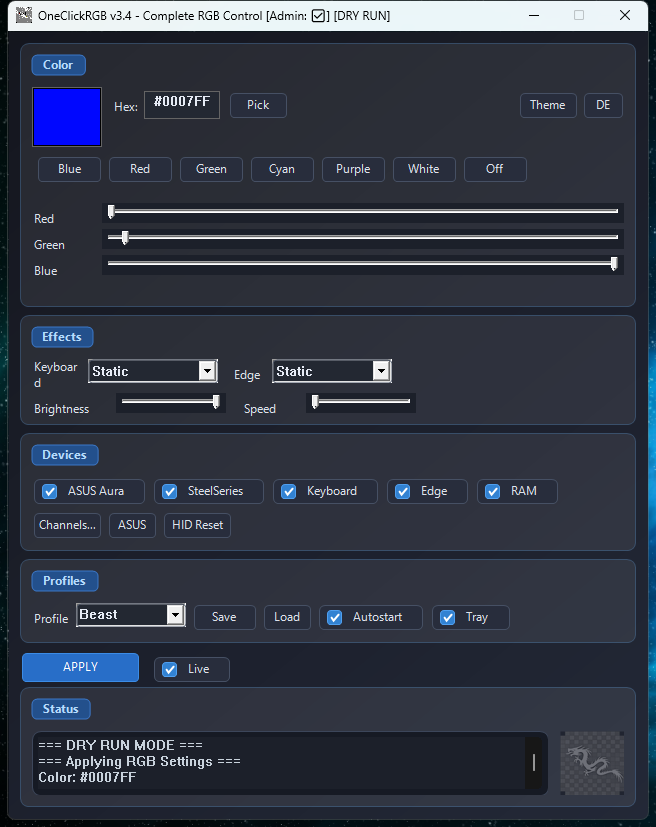

# OneClickRGB - Visual User Guide

## Installation

### Step 1: Download

Download the latest release from [GitHub Releases](https://github.com/beastwareteam/OneClickRGB/releases).


### Step 2: Extract

Extract the ZIP file to any folder. You need these files:

```
OneClickRGB/
├── OneClickRGB.exe    ← Main application
├── hidapi.dll         ← Required library
├── PawnIOLib.dll      ← For RAM control (optional)
└── SmbusI801.bin      ← For RAM control (optional)
```

### Step 3: Run

Double-click `OneClickRGB.exe` to start.

> **Tip:** Right-click → "Run as Administrator" for full device access.

---

## Main Window



| Area | Description |
|------|-------------|
| **1** | Color preview - Shows current selected color |
| **2** | RGB sliders - Adjust Red, Green, Blue values |
| **3** | Hex input - Enter color code directly (e.g., `#FF0000`) |
| **4** | Device checkboxes - Select which devices to control |
| **5** | Apply button - Send color to selected devices |
| **6** | Preset colors - Quick color selection |

---

## Selecting a Color

### Method 1: RGB Sliders


1. Drag the **R** slider for red (0-255)
2. Drag the **G** slider for green (0-255)
3. Drag the **B** slider for blue (0-255)
4. Click **Apply**

### Method 2: Hex Code


1. Click the hex input field
2. Type a color code: `#0022FF` (blue)
3. Press Enter or click **Apply**

### Method 3: Preset Colors


Click any preset button for quick colors:
- 🔵 Blue
- 🔴 Red
- 🟢 Green
- ⚪ White
- 🟣 Purple
- 🟡 Yellow

---

## Device Selection


Check the devices you want to control:

| Checkbox | Device |
|----------|--------|
| **Aura** | ASUS Aura Mainboard RGB |
| **Mouse** | SteelSeries Mouse |
| **Keyboard** | EVision Keyboard |
| **RAM** | G.Skill DDR5 RGB |
| **Edge** | Keyboard edge lighting |

> **Note:** Only connected devices will respond. Unchecking a device leaves it unchanged.

---

## System Tray


OneClickRGB minimizes to the system tray (bottom-right corner).

### Tray Menu

Right-click the tray icon:


| Option | Action |
|--------|--------|
| **Blue/Red/Green/White** | Quick color presets |
| **Off** | Turn off all LEDs |
| **Profiles →** | Load saved profiles |
| **Power →** | Standby, Shutdown, Restart |
| **Show** | Open main window |
| **Exit** | Close application |

---

## Global Hotkeys

Control RGB without opening the window:

| Hotkey | Action |
|--------|--------|
| `Ctrl+Alt+1` | Set Blue |
| `Ctrl+Alt+2` | Set Red |
| `Ctrl+Alt+3` | Set Green |
| `Ctrl+Alt+4` | Set White |
| `Ctrl+Alt+0` | Turn Off |
| `Ctrl+Alt+Space` | Toggle On/Off |


---

## Profiles

### Saving a Profile


1. Set your desired color
2. Click **Save Profile**
3. Enter a name
4. Click **OK**

### Loading a Profile


1. Click the profile dropdown
2. Select a saved profile
3. Color is applied automatically

---

## Keyboard Effects


For EVision keyboards, select an effect mode:

| Effect | Description |
|--------|-------------|
| **Static** | Solid color |
| **Breathing** | Fade in/out |
| **Wave** | Color wave across keys |
| **Spectrum** | Rainbow cycle |
| **Reactive** | Light up on keypress |

---

## Troubleshooting

### Device Not Found


**Solutions:**
1. Run as Administrator
2. Check USB connection
3. Try different USB port
4. Restart the application

### RAM Not Working


**Solutions:**
1. Ensure `PawnIOLib.dll` is present
2. Ensure `SmbusI801.bin` is present
3. Run as Administrator
4. Check if PawnIO driver is installed

### Colors Don't Persist After Sleep


**Solution:** Keep OneClickRGB running in the system tray. It automatically restores colors after Windows wakes up.

---

## Tips

1. **Start with Windows**: Enable autostart in settings to apply colors on boot
2. **Minimize to Tray**: Close button minimizes instead of exiting
3. **Quick Access**: Use global hotkeys for fastest color changes
4. **Save Profiles**: Save your favorite colors for quick switching

---

## Screenshots Needed

To complete this guide, add these screenshots to `docs/screenshots/`:

- [ ] `01_download.png` - GitHub releases page
- [ ] `02_main_window.png` - Full application window
- [ ] `03_sliders.png` - RGB sliders in use
- [ ] `04_hex_input.png` - Hex color input
- [ ] `05_presets.png` - Preset color buttons
- [ ] `06_devices.png` - Device checkboxes
- [ ] `07_tray_icon.png` - System tray icon
- [ ] `08_tray_menu.png` - Tray right-click menu
- [ ] `09_hotkeys.png` - Hotkey demonstration
- [ ] `10_save_profile.png` - Save profile dialog
- [ ] `11_load_profile.png` - Profile dropdown
- [ ] `12_keyboard_effects.png` - Effect mode dropdown
- [ ] `13_error_device.png` - Device not found message
- [ ] `14_error_ram.png` - RAM error message
- [ ] `15_sleep_fix.png` - Settings for sleep recovery

Use `Win+Shift+S` to capture screenshots on Windows.
